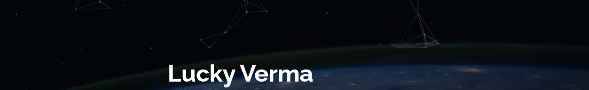

### Hello World 👋 AI Enthusiast here! 🤖

I'm **Lucky Verma**, a **Deep Learning** and **Machine Learning** **Practitioner** and **Learner**. I'm here to solve things, Learning a lot in the Process.

**Pinned**

- ⚡ [Gesture Control of Drone](https://github.com/lucky-verma/GCOD)
- ⚡ [Invoice Information extraction(IE)](https://github.com/lucky-verma/Invoice-Data-Extraction)
- ⚡ [Driving License Data Extraction](https://github.com/lucky-verma/US-Driver-License-data-extraction)
<!-- - ⚡ [Camera to Face Distance](https://github.com/lucky-verma/camera-to-face-distance) -->

**Updates:**

- 🌱 I’m currently learning from [Coursera](https://www.coursera.org/), [Fast.ai](https://course.fast.ai/#) and reading Books and Online materials.
- 👯 I’m looking to collaborate on **Data Science**, **Machine Learning** and **Deep Learning**
- 📫 How to reach me: [Connect/Message](https://www.linkedin.com/in/lucky-verma/)

### **Find me around:**

[][twitter]
[][linkedin]

[black_bmc]: https://www.buymeacoffee.com/luckyverma
[linkedin]: https://www.linkedin.com/in/lucky-verma/
[twitter]: https://twitter.com/luckieverma/

  

   
   
   
  
   
  
  
   
  
   
  

<!-- ### **Language and Tools**

 -->

<!--
**lucky-verma/lucky-verma** is a ✨ _special_ ✨ repository because its `README.md` (this file) appears on your GitHub profile.

Here are some ideas to get you started:
- 🔭 I’m currently working as a Developer Internship at [**Information and Language Processing Research Lab**](https://ilprl.ku.edu.np/)
- 🔭 I’m currently working on ...
- 🌱 I’m currently learning ...
- 👯 I’m looking to collaborate on ...
- 🤔 I’m looking for help with ...
- 💬 Ask me about ...
- 📫 How to reach me: ...
- 😄 Pronouns: ...
- ⚡ Fun fact: ...

-->
